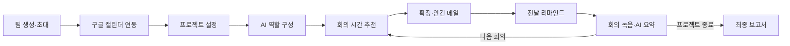
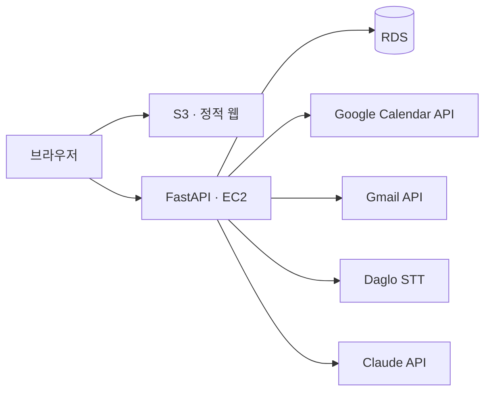

  <picture>
    <source media="(prefers-color-scheme: dark)" srcset="./docs/logo-dark.svg" />
    
  </picture>
  
<strong>팀플 일정 조율부터 회의 기록, 최종 보고서까지 챙겨주는 AI 에이전트</strong>

  
구글 캘린더로 모두가 되는 시간을 찾고, 회의 안건과 요약, 리마인드를 AI가 대신 챙깁니다.

  

    
    
    
    
    
    
    
  

<!-- TODO: 랜딩 화면 캡처를 docs/assets/readme/landing.png로 넣고 아래 주석을 푸세요.

  

-->

2026년 국민대학교 캠퍼스타운 키로톤 09팀 프로젝트입니다.

> **배포 주소:** `TODO`  
> AWS S3, EC2, RDS를 사용해 운영합니다.

[서비스 소개](#서비스-소개) · [서비스 흐름](#서비스-흐름) · [화면 미리보기](#화면-미리보기) · [주요 기능](#주요-기능) · [회의 시간 추천 규칙](#회의-시간-추천-규칙) · [AI 활용](#ai-활용) · [기술 구성](#기술-구성) · [Kiro 활용](#kiro-활용) · [팀](#팀)

## 서비스 소개

팀 프로젝트가 필요하다는 데에는 학생도 교원도 동의합니다. 국민대신문이 2026년 5월 국민대 학부생 152명과 교원 18명을 조사한 결과, 교과목에 팀플이 필요하다는 응답은 학생 68.4%, 교원 77.8%였습니다. 그런데 같은 조사에서 학생의 84.9%는 팀플보다 개인 과제를 선호했고, 그 이유로 일정 조율의 번거로움(66.7%), 무임승차자 문제(65.9%), 소통과 의견 조율의 부담(65.1%)을 꼽았습니다.

이 부담은 대부분 조장 한 사람에게 몰립니다. 모두의 일정을 하나하나 물어 회의를 잡고, 안건을 정하고, 회의 내용을 정리해 불참자에게 전하는 일이 매주 반복됩니다. 그래서 아무도 조장을 맡으려 하지 않습니다.

맞춤은 이 관리 일을 AI 에이전트가 대신합니다. 팀원들이 구글 캘린더를 연동하면 모두가 가능한 회의 시간을 찾아 추천하고, 회의마다 안건을 정해 메일로 보내고, 회의 녹음을 요약해 공유합니다. 프로젝트가 끝나면 주차별 활동을 정리한 최종 보고서를 만들어 줍니다.

| 문제 | 맞춤의 해결 |
|---|---|
| 일정 조율 | 구글 캘린더를 연동하면 모두가 가능한 회의 시간을 자동으로 추천 |
| 책임의 쏠림 | 역할 구성, 안건, 리마인드, 회의 요약을 AI가 맡아 조장의 관리 부담을 줄이고, 주차별 보고서로 진행 과정을 기록 |
| 소통 부담 | 회의 안건을 미리 보내고 회의 내용을 요약해 공유 |

출처: 김지원 · 박예원, [「확산되는 팀플 기피 현상, 과정과 소통 속 역량 강화에 주목해야」](https://media.kookmin.ac.kr/news/articleView.html?idxno=104600), 국민대신문 1022호, 2026.06.01. 설문 기간 2026.05.15 ~ 05.20, 개인 과제 선호 이유는 복수 응답.

## 서비스 흐름

1. 팀장이 팀원들의 이메일을 입력하면 초대 링크가 발송됩니다.
2. 팀장과 팀원 모두 구글 캘린더를 연동합니다. Google Calendar API로 각자의 일정을 JSON으로 자동 수집합니다.
3. 팀장이 최소·최대 회의 시간, 선호 회의 시간, 예상 회의 횟수, 최종 목적, 데드라인을 정해진 입력 칸에 작성합니다. 챗봇 대화 방식이 아닙니다.
4. AI가 최종 목적과 팀원 수를 바탕으로 필요한 역할을 나눕니다. 누가 어떤 역할을 맡을지는 정하지 않고 역할 구성만 제시합니다.
5. 회의 후보 3개를 추천합니다. "다른 옵션도 보시겠습니까?"를 누르면 이전 후보를 제외하고 새로 3개를 추천합니다.
6. 팀장이 시간을 확정하면 AI가 과제 목표에 맞춰 회의 안건을 정하고, 일정과 안건을 전원에게 메일로 보냅니다.
7. 회의 전날 전원에게 리마인드 메일을 보냅니다.
8. 회의 중 웹페이지의 녹음 버튼을 누르면 다글로 API로 말한 내용이 텍스트로 기록되고, 회의가 끝나면 AI가 요약과 진행상황 분석을 만듭니다.
9. 다음 회의 후보를 다시 추천하고, 팀장이 확정하면 이번 회의 요약본과 다음 일정을 전원에게 보냅니다. 6~9단계가 프로젝트가 끝날 때까지 반복됩니다.
10. 모든 회의가 끝나면 AI가 주차별 활동을 담은 최종 보고서를 작성해 웹페이지에 보여줍니다.

## 화면 미리보기

<!-- TODO: 화면 캡처를 docs/assets/readme/ 에 넣고 아래 주석을 푸세요.

### 회의 시간 추천

  

참석 가능 인원과 선호 시간대 여부가 표시된 후보 3개 중에서 회의 시간을 고릅니다.

### 회의 녹음과 요약

  

녹음 버튼으로 회의를 기록하고, 요약·결정사항·할 일·다음 안건을 확인합니다.

### 최종 보고서

  

프로젝트가 끝나면 주차별 활동과 주요 의사결정을 정리한 보고서를 확인합니다.
-->

`TODO` 화면 캡처 추가 예정

## 주요 기능

| 기능 | 구현 내용 |
|---|---|
| 팀 생성·초대 | 팀장이 팀원 이메일을 입력하면 초대 링크 발송 |
| 일정 수집 | Google Calendar API로 팀원별 일정을 JSON으로 자동 수집 |
| 프로젝트 설정 | 회의 시간 범위, 선호 시간대, 예상 회의 횟수, 최종 목적, 데드라인을 고정 입력 칸으로 작성 |
| 역할 구성 | 최종 목적과 팀원 수에 맞춰 AI가 역할 구성을 제안 (배정은 팀이 직접) |
| 회의 시간 추천 | 결정적 알고리즘으로 후보 3개 추천, 재추천 시 이전 후보 제외 |
| 회의 안건 | 과제 목표, 회차, 이전 회의 요약을 반영해 AI가 안건 생성 |
| 메일 발송 | 팀장 구글 계정의 Gmail API로 초대·일정 확정·리마인드·요약 메일 발송 |
| 회의 기록 | 웹 녹음 버튼과 다글로 STT로 회의 내용을 텍스트로 기록 |
| 회의 요약 | 요약, 결정사항, 할 일(담당자·기한), 막힌 점, 다음 안건 정리 |
| 진행상황 | 처음 설정한 목표 대비 현재 진행 정도와 다음 할 일 안내 |
| 최종 보고서 | 전체 회의 기록으로 주차별 활동 보고서 작성 |

### 메일 종류

| 메일 | 시점 | 받는 사람 |
|---|---|---|
| 초대 | 프로젝트 생성 후 | 전원 |
| 일정 확정 | 팀장이 회의 시간을 확정했을 때 (AI 안건 포함) | 전원 |
| 리마인드 | 회의 전날 | 전원 |
| 회의 요약 | 회의 요약 후 (다음 회의 일정 포함, 회의록 `.md` 첨부) | 전원 |

## 회의 시간 추천 규칙

회의 시간은 LLM이 아니라 결정적 알고리즘이 계산합니다. 같은 입력이면 항상 같은 결과가 나오고, 존재하지 않는 시간을 추천하지 않습니다.

- 앞으로 14일, 데드라인이 더 가까우면 데드라인까지 30분 단위로 후보를 만듭니다.
- 최대 회의 시간으로 먼저 찾고, 후보가 없으면 최소 회의 시간으로 다시 찾습니다.
- 참석률 50% 미만인 후보는 모든 회의에서 제외합니다.
- 첫 회의는 전원이 참석할 수 있는 시간이 있으면 그 시간만 보여줍니다.
- 정렬 순서는 날짜가 가까운 순, 참석 인원이 많은 순, 선호 시간대 우선, 시작 시각이 이른 순입니다.
- 후보는 한 번에 3개씩 보여주며, 재추천 시 이미 보여준 후보는 제외합니다.

## AI 활용

Claude(Anthropic API)는 판단과 글쓰기가 필요한 곳에만 씁니다.

| 영역 | 입력 | 출력 |
|---|---|---|
| 역할 구성 | 최종 목적, 팀원 수 | 필요한 역할 목록 |
| 회의 안건 | 프로젝트 목표, 데드라인, 회차, 이전 회의 요약 | 제목, 회의 목표, 안건 목록 |
| 회의 요약·진행상황 | 회의록 원문, 팀원 이름, 프로젝트 목표 | 요약, 결정사항, 할 일, 막힌 점, 다음 안건 |
| 최종 보고서 | 전체 회의 기록 | 주차별 활동, 의사결정, 역할 등을 담은 보고서 |

모든 응답은 JSON으로 받아 형식을 검증합니다. 검증이나 호출에 실패하면 미리 정해둔 대체 결과를 사용해 흐름이 멈추지 않습니다. 회의록에 없는 담당자나 기한은 저장하지 않습니다.

음성 인식은 한국어 회의에 맞춰 다글로(Daglo) STT API를 사용합니다.

## 기술 구성

| 영역 | 기술 |
|---|---|
| 프론트엔드 | HTML, JavaScript, Amazon S3 정적 호스팅 |
| API | FastAPI, Amazon EC2 |
| 데이터베이스 | Amazon RDS |
| 일정 연동 | Google Calendar API |
| 메일 | Gmail API (팀장 구글 계정) |
| 음성 인식 | Daglo STT API |
| 생성형 AI | Claude (Anthropic API) |
| 개발 도구 | Kiro 커스텀 에이전트 |

프론트엔드(S3), API 서버(EC2), 데이터베이스(RDS)를 계층별로 분리했습니다. 외부 API는 모두 FastAPI 서버를 통해서만 호출해 브라우저에 API 키와 토큰이 노출되지 않습니다.

## Kiro 활용

4명이 짧은 시간 안에 동시에 바이브코딩하기 위해 Kiro 커스텀 에이전트를 담당별로 나눴습니다. 설정은 [`.kiro/agents`](.kiro/agents)에 있습니다.

| 에이전트 | 담당 |
|---|---|
| `matchum-a` | 프론트엔드: 화면, 컴포넌트 |
| `matchum-b` | 스케줄링 엔진: 회의 시간 추천 알고리즘과 테스트 |
| `matchum-c` | 구글 연동: OAuth, 캘린더, Gmail, 리마인드 |
| `matchum-d` | Claude 연동과 데이터 저장 |
| `matchum` | 전체 통합 |

각 에이전트의 프롬프트에 다음 규칙을 넣었습니다.

| 규칙 | 내용 |
|---|---|
| 폴더 경계 | 자기 담당 폴더만 수정하고, 다른 담당 파일을 고쳐야 하면 멈추고 알립니다. 여러 명이 동시에 작업해도 충돌이 나지 않습니다. |
| 계약 우선 | 공통 타입을 팀 전체의 계약으로 먼저 고정하고, 계약에 없는 필드는 만들지 않고 제안만 합니다. |
| LLM 역할 제한 | 시간 계산에는 LLM을 쓰지 않고, Claude는 정해진 기능에만 씁니다. |
| 보안 | API 키와 OAuth 토큰은 서버에서만 다루고 화면이나 로그에 노출하지 않습니다. |
| 작업 방식 | 큰 작업은 계획을 번호 목록으로 먼저 쓰고 승인 후 진행합니다. 모르는 것은 지어내지 않고 "확인 필요"라고 답합니다. |

## 빠른 시작

`TODO` 코드 정리 후 설치·실행 방법 추가 예정

## 주요 설정

`TODO` 코드 정리 후 환경변수 목록 추가 예정

## 현재 제한사항

`TODO` 제출 전 확인해서 작성

## 저장소 구조

`TODO` 코드 정리 후 추가 예정

## 팀

| 담당 | 역할 |
|---|---|
| `TODO` | 역할 A · 프론트엔드 |
| `TODO` | 역할 B · 스케줄링 엔진 |
| `TODO` | 역할 C · 구글 연동 |
| `TODO` | 역할 D · Claude 연동·데이터 저장 |

제출 기준 브랜치는 `main`입니다.
