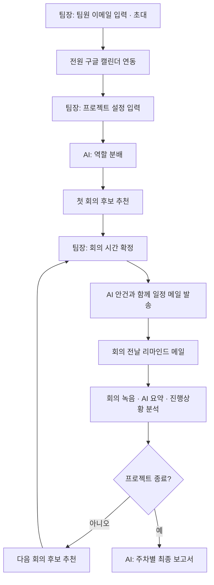
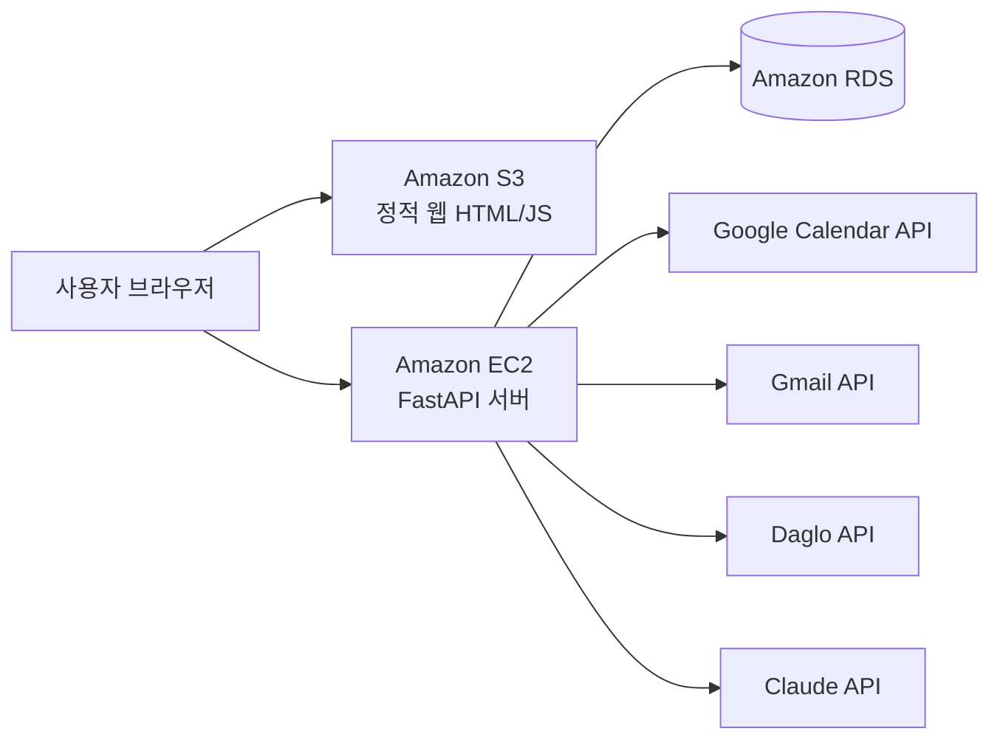

# 맞춤

> 팀플 일정 조율부터 회의 기록, 최종 보고서까지 챙겨주는 AI 에이전트

2026 국민대학교 캠퍼스타운 키로톤 09팀

## 왜 만들었나요?

팀 프로젝트가 중요하다는 데에는 학생도 교원도 모두 동의합니다.
그런데도 학생들은 팀플을 피하고 싶어 합니다. 이유는 크게 두 가지입니다.

### 1. 책임의 쏠림
책임감 있는 팀원은 열심히 하고, 그렇지 않은 팀원은 참여하지 않습니다.
결국 일을 챙기는 소수에게 부담이 몰리고, 그래서 아무도 조장을 맡으려 하지 않습니다.

### 2. 일정 조율의 번거로움
모임 한 번을 잡으려 해도 모든 팀원의 일정을 하나하나 물어보고 맞춰야 합니다.
이 과정이 매 회의마다 반복되고, 대부분 조장 한 사람이 떠안습니다.

**맞춤**은 이 두 가지 부담을 AI 에이전트로 덜어내기 위해 만들었습니다.

| 문제 | 맞춤의 해결 |
|---|---|
| 책임의 쏠림 | AI가 역할을 나누고, 안건을 정하고, 리마인드 메일을 보내고, 회의록을 요약해 조장이 하던 관리 일을 대신합니다. 주차별 활동 보고서로 팀의 진행 과정이 기록으로 남습니다. |
| 일정 조율 | 구글 캘린더를 연동하면 모두가 가능한 회의 시간을 자동으로 찾아 추천합니다. |

## 어떻게 동작하나요?

### 1. 팀 만들기
팀장이 팀원들의 이메일을 입력하면 초대 링크가 발송됩니다.

### 2. 일정 수집
팀장과 팀원 모두 구글 캘린더를 연동합니다.
Google Calendar API로 각자의 일정을 JSON 형태로 자동으로 가져오기 때문에, 시간표를 따로 입력할 필요가 없습니다.

### 3. 프로젝트 설정
팀장이 정해진 입력 칸에 다음 내용을 작성합니다. (챗봇 대화 방식이 아닙니다.)

| 항목 | 설명 |
|---|---|
| 최소 · 최대 회의 시간 | 한 번의 회의 길이 범위 |
| 선호 회의 시간 | 팀이 선호하는 시간대 |
| 예상 회의 횟수 | 프로젝트 기간 동안 모일 대략적인 횟수 |
| 최종 목적 | 과제나 대회의 성격, 목표 결과물 |
| 데드라인 | 최종 마감일 |

### 4. 역할 분배
AI가 최종 목적과 팀원 수를 바탕으로 필요한 역할을 나눕니다. (예: 팀원1 프론트엔드, 팀원2 백엔드)
누가 어떤 역할을 맡을지는 정하지 않고, 역할 구성만 제시합니다.

### 5. 첫 회의 추천
프로젝트 설정과 전원의 캘린더를 바탕으로 회의 후보 3개를 제시합니다.
"다른 옵션도 보시겠습니까?"를 선택하면 앞서 보여준 후보를 제외하고 새로운 후보 3개를 다시 추천합니다.
추천 방식은 아래 [회의 시간 추천 규칙](#회의-시간-추천-규칙)에 정리했습니다.

### 6. 일정 확정 및 안내
팀장이 시간을 확정하면, AI가 과제 목표와 최종 결과물을 고려해 첫 회의 안건을 정합니다.
확정된 일정과 안건은 모든 팀원에게 메일로 발송됩니다.

### 7. 리마인드
회의 전날 모든 팀원에게 리마인드 메일을 보냅니다.
> 내일 OO시~OO시까지 회의가 예정되어 있습니다. 예상 회의 안건은 다음과 같습니다. …

### 8. 회의 녹음 및 요약
회의를 시작할 때 웹페이지의 녹음 버튼을 누르면, 회의 중 오간 말이 다글로(Daglo) API를 통해 자동으로 텍스트로 기록됩니다.
회의가 끝나면 AI가 기록된 내용을 바탕으로 회의를 요약합니다.

### 9. 진행상황 분석
AI가 회의 내용을 처음 설정한 목표와 비교해 현재 어디까지 진행됐는지, 다음 회의에서 무엇을 해야 하는지 정리합니다.

### 10. 다음 회의 추천
프로젝트 설정(회의 시간 범위, 선호 시간, 예상 횟수)을 다시 반영해 다음 회의 후보 3개를 추천합니다.
팀장이 확정하면 이번 회의 요약본과 다음 회의 일정이 전원에게 메일로 발송됩니다. 회의록은 파일로 첨부되어, 회의에 참석하지 못한 팀원도 흐름을 놓치지 않습니다.
회의 전날에는 리마인드 메일이 다시 나갑니다.

이후 7~10단계가 프로젝트가 끝날 때까지 반복됩니다.

### 11. 최종 보고서
모든 회의가 끝나면 AI가 지금까지의 기록을 정리해 주차별 활동을 담은 최종 보고서를 작성하고, 웹페이지에 보여줍니다.

## 회의 시간 추천 규칙

회의 시간은 LLM이 아니라 결정적 알고리즘이 계산합니다. 같은 입력이면 항상 같은 결과가 나오고, AI가 존재하지 않는 시간을 지어낼 수 없습니다.

- 앞으로 14일(데드라인이 더 가까우면 데드라인까지) 안에서 30분 단위로 후보를 만듭니다.
- 최대 회의 시간으로 먼저 찾고, 후보가 없으면 최소 회의 시간으로 다시 찾습니다.
- 참석률 50% 미만인 후보는 모든 회의에서 제외합니다.
- 첫 회의는 전원이 참석할 수 있는 시간이 있으면 그 시간만 보여줍니다.
- 정렬 순서는 날짜가 가까운 순 → 참석 인원이 많은 순 → 선호 시간대 우선 → 시작 시각이 이른 순입니다.
- 후보는 한 번에 3개씩 보여주며, 재추천 시 이전 후보는 제외합니다.

## AI(Claude)를 쓰는 곳

Claude는 판단과 글쓰기가 필요한 곳에만 씁니다.

| 기능 | 입력 | 출력 |
|---|---|---|
| 역할 분배 | 최종 목적, 팀원 수 | 필요한 역할 구성 |
| 회의 안건 생성 | 프로젝트 목표, 데드라인, 회차, 이전 회의 요약 | 제목, 회의 목표, 안건 목록 |
| 회의록 요약 · 진행상황 분석 | 회의록 원문, 팀원 이름, 프로젝트 목표 | 요약, 결정사항, 할 일(담당자 · 기한), 막힌 점, 다음 안건 |
| 최종 보고서 | 전체 회의 기록 | 주차별 활동, 의사결정, 역할 등을 담은 보고서 |

모든 응답은 JSON으로 받아 형식을 검증합니다. 검증에 실패하거나 호출이 실패하면 미리 정해둔 대체 결과를 사용해 서비스가 멈추지 않습니다. 회의록에 없는 담당자나 기한은 저장하지 않습니다.

## 메일 발송

메일은 팀장의 구글 계정으로 Gmail API를 통해 보냅니다.

| 메일 | 시점 | 받는 사람 |
|---|---|---|
| 초대 | 프로젝트 생성 후 | 전원 |
| 일정 확정 | 팀장이 회의 시간을 확정했을 때 (AI 안건 포함) | 전원 |
| 리마인드 | 회의 전날 | 전원 |
| 회의 요약 | 회의록 요약 후 (다음 회의 일정 포함, 회의록 .md 첨부) | 전원 |

## 아키텍처

프론트엔드(S3), 애플리케이션 서버(EC2), 데이터베이스(RDS)를 계층별로 분리했습니다.
외부 API(Google, Daglo, Claude)는 모두 FastAPI 서버를 통해서만 호출해, 브라우저에 API 키와 토큰이 노출되지 않도록 했습니다.

## 기술 스택

| 구분 | 사용 기술 | 역할 |
|---|---|---|
| 프론트엔드 | HTML, JavaScript (Amazon S3 정적 호스팅) | 사용자 화면 |
| 백엔드 | FastAPI (Amazon EC2) | API 서버, 추천 알고리즘, 메일 발송 |
| 데이터베이스 | Amazon RDS | 팀, 일정, 회의록, 보고서 저장 |
| 일정 연동 | Google Calendar API | 팀원 일정 자동 수집 |
| 음성 인식 | Daglo API | 회의 녹음을 텍스트로 변환 (한국어 회의에 최적화) |
| AI | Claude (Anthropic API) | 역할 분배, 안건 생성, 회의 요약, 진행상황 분석, 최종 보고서 |
| 메일 | Gmail API | 초대, 일정 안내, 리마인드, 요약본 발송 |
| 개발 도구 | Kiro | 역할별 커스텀 에이전트로 바이브코딩 |

## Kiro로 어떻게 만들었나

4명이 짧은 시간 안에 동시에 개발하기 위해 Kiro 커스텀 에이전트를 역할별로 나눴습니다. 설정은 `.kiro/agents`에 있습니다.

| 에이전트 | 담당 |
|---|---|
| matchum-a | 프론트엔드: 화면, 컴포넌트 |
| matchum-b | 스케줄링 엔진: 회의 시간 추천 알고리즘과 테스트 |
| matchum-c | 구글 연동: OAuth, 캘린더, Gmail, 리마인드 |
| matchum-d | Claude 연동과 데이터 저장 |
| matchum | 전체 통합 |

각 에이전트의 프롬프트에 다음 규칙을 넣었습니다.

- **폴더 경계**: 자기 담당 폴더만 수정하고, 다른 담당의 파일을 고쳐야 하면 멈추고 알립니다. 여러 명이 동시에 바이브코딩해도 충돌이 나지 않습니다.
- **계약 우선**: 공통 타입 파일을 팀 전체의 계약으로 먼저 고정하고, 계약에 없는 필드는 만들지 않고 제안만 합니다.
- **LLM의 역할 제한**: 시간 계산에는 LLM을 쓰지 않고, Claude는 정해진 기능에만 씁니다.
- **보안**: API 키와 OAuth 토큰은 서버에서만 다루고 화면이나 로그에 노출하지 않습니다.
- **작업 방식**: 큰 작업은 계획을 먼저 번호 목록으로 쓰고 승인을 받은 뒤 진행합니다. 모르는 것은 지어내지 않고 "확인 필요"라고 답합니다.
