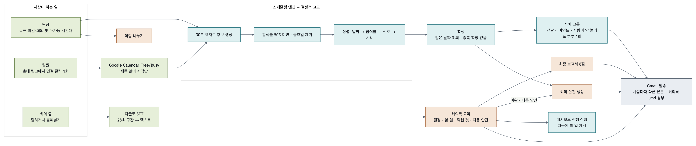
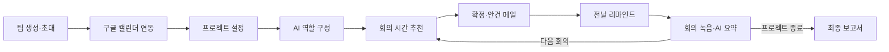
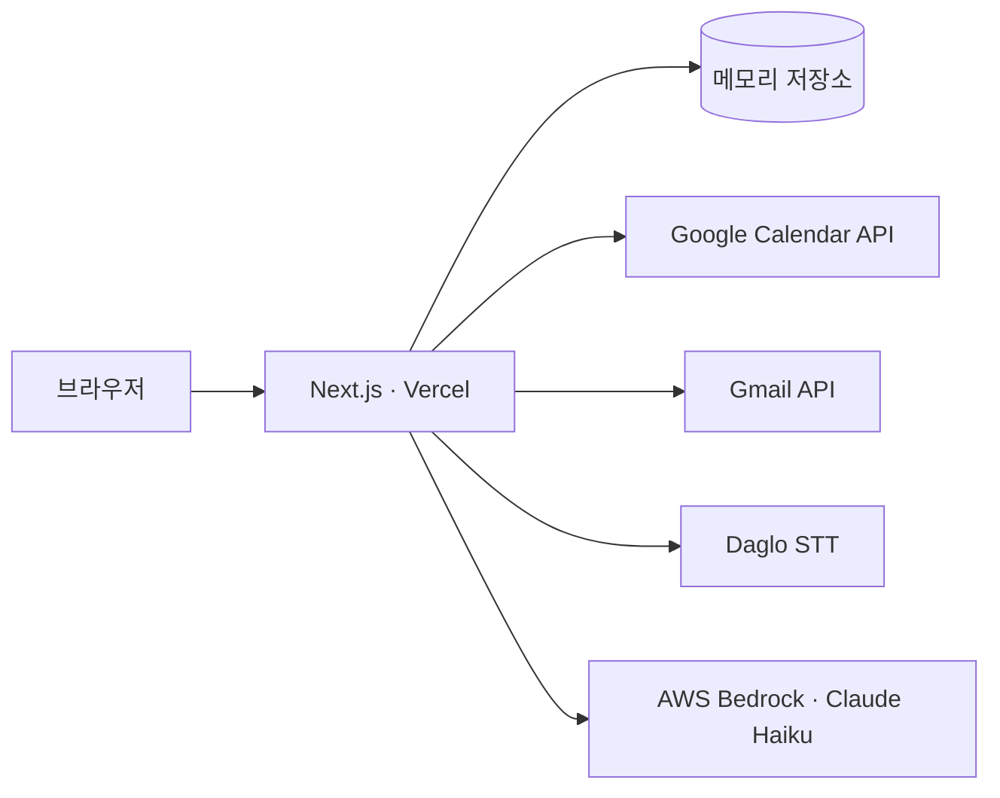

<div align="center">
  <h1>맞춤</h1>
  <p><strong>팀플 일정 조율부터 회의 기록, 최종 보고서까지 챙겨주는 AI 에이전트</strong></p>
  <p>구글 캘린더로 모두가 되는 시간을 찾고, 회의 안건과 요약, 리마인드를 AI가 대신 챙깁니다.</p>
  <p>
    
    
    
    
    
    
  </p>
</div>

2026년 국민대학교 캠퍼스타운 키로톤 09팀 프로젝트입니다.

> **배포 주소:** https://kirothon-hackerthon.vercel.app
> **LLM:** AWS Bedrock (Claude Haiku) — 주최측 게이트웨이 경유

[서비스 소개](#서비스-소개) · [전체 흐름](#전체-흐름) · [주요 기능](#주요-기능) · [회의 시간 추천 규칙](#회의-시간-추천-규칙) · [AI 활용](#ai-활용) · [기술 구성](#기술-구성) · [빠른 시작](#빠른-시작) · [환경 변수](#환경-변수) · [테스트](#테스트) · [저장소 구조](#저장소-구조) · [Kiro 활용](#kiro-활용) · [현재 제한사항](#현재-제한사항) · [팀](#팀)

## 서비스 소개

팀 프로젝트가 필요하다는 데에는 학생도 교원도 동의합니다. 국민대신문이 2026년 5월 국민대 학부생 152명과 교원 18명을 조사한 결과, 교과목에 팀플이 필요하다는 응답은 학생 68.4%, 교원 77.8%였습니다. 그런데 같은 조사에서 학생의 84.9%는 팀플보다 개인 과제를 선호했고, 그 이유로 일정 조율의 번거로움(66.7%), 무임승차자 문제(65.9%), 소통과 의견 조율의 부담(65.1%)을 꼽았습니다.

이 부담은 대부분 조장 한 사람에게 몰립니다. 모두의 일정을 하나하나 물어 회의를 잡고, 안건을 정하고, 회의 내용을 정리해 불참자에게 전하는 일이 매주 반복됩니다. 그래서 아무도 조장을 맡으려 하지 않습니다.

맞춤은 이 관리 일을 대신합니다. **회의 시간은 결정적 알고리즘이 계산하고, AI는 안건·요약·보고서·역할 구성처럼 글로 정리하는 일만 맡습니다.** 팀원이 하는 일은 초대 링크에서 캘린더를 연결하는 클릭 한 번이고, 그 뒤로는 메일로 받습니다.

| 문제 | 맞춤의 해결 |
|---|---|
| 일정 조율 | 구글 캘린더 Free/Busy로 모두가 가능한 시간을 계산해 후보 3개 제시 |
| 책임의 쏠림 | 역할 구성·안건·리마인드·요약을 자동화하고, 회차가 끊기지 않게 미완 항목을 다음 회의로 이어줌 |
| 소통 부담 | 사람마다 본문이 다른 메일을 보내고, 요약 메일에 회의록 `.md`를 첨부 |

<sub>출처: 김지원 · 박예원, [「확산되는 팀플 기피 현상, 과정과 소통 속 역량 강화에 주목해야」](https://media.kookmin.ac.kr/news/articleView.html?idxno=104600), 국민대신문 1022호, 2026.06.01. 설문 기간 2026.05.15 ~ 05.20, 개인 과제 선호 이유는 복수 응답.</sub>

## 전체 흐름

<p align="center">
  
</p>

색이 곧 설계입니다. **초록**은 사람과 외부 API, **청록**은 결정적 코드, **주황**은 AI(Bedrock), **회색**은 결과물입니다.
**시간을 정하는 경로(청록)에는 AI가 한 번도 등장하지 않습니다.** 요약에서 다음 회의 안건으로 돌아가는 화살표가 회차를 잇는 고리입니다.



1. 팀장이 팀원 이메일을 입력해 프로젝트를 만들면 팀원별 초대 링크가 생깁니다.
2. 팀장과 팀원이 각자 초대 링크에서 구글 캘린더를 연결합니다. **Free/Busy만 조회**하므로 일정 제목·참석자는 요청하지도 저장하지도 않습니다.
3. 팀장이 최소·최대 회의 시간, 선호 시간대, 예상 회의 횟수, 최종 목적, 데드라인을 **고정 입력 칸**에 작성합니다. 챗봇 대화 방식이 아닙니다.
4. AI가 최종 목적과 팀원 수를 보고 역할을 나눕니다. **누가 맡을지는 정하지 않고** 역할 구성만 제시합니다.
5. 회의 후보 3개를 추천합니다. "다른 옵션도 보시겠습니까?"를 누르면 이전 후보를 제외하고 새로 3개를 냅니다.
6. 팀장이 시간을 확정하면 AI가 안건을 만들고, 일정과 안건을 전원에게 메일로 보냅니다.
7. 회의 전날 서버 크론이 스스로 리마인드 메일을 보냅니다. **사람이 아무것도 누르지 않아도 도는 유일한 단계**입니다.
8. 회의 중 녹음 버튼을 누르면 다글로 STT가 말을 받아써 회의록 칸에 쌓고, 정리하기를 누르면 AI가 요약합니다.
9. 요약 메일에 **회의록 마크다운 파일**이 첨부됩니다. 못 온 사람은 그 파일 하나로 따라올 수 있습니다.
10. 대시보드에 진행 상황과 "지금 해야 할 한 가지"가 뜨고, 다음 회의 추천으로 이어집니다. 모든 회의가 끝나면 8개 절짜리 최종 보고서가 나옵니다.

## 주요 기능

| 기능 | 구현 내용 | 위치 |
|---|---|---|
| 팀 생성·초대 | 팀원별 초대 토큰 발급, 초대 메일 발송 | `app/projects/new` · `app/api/projects` |
| 캘린더 연동 | Google OAuth. 팀원은 `calendar.freebusy`, 팀장은 `gmail.send` 추가 | `lib/google/oauth.ts` · `app/api/auth/google` |
| 일정 수집 | Free/Busy만 조회해 바쁜 구간의 시작·끝 시각만 저장 | `lib/google/calendar.ts` |
| 역할 구성 | 최종 목적과 팀원 수에 맞춰 역할을 나눔 (배정은 팀이 직접) | `lib/claude/roles.ts` |
| 회의 시간 추천 | 결정적 알고리즘. 후보 3개씩, 재추천 시 이전 후보 제외 | `lib/scheduler.ts` |
| 공휴일 제외 | 한국 공휴일은 후보에서 뺌 (구독 캘린더라 Free/Busy에 안 잡힘) | `lib/holidays.ts` |
| 회의 확정 | 같은 슬롯 중복 확정 방지, 확정한 날짜는 다음 추천에서 제외 | `app/api/schedule/confirm` |
| 회의 안건 | 목표·마감·회차·이전 요약을 반영해 생성 | `lib/claude/agenda.ts` |
| 메일 발송 | 팀장 계정의 Gmail API. 사람마다 본문이 다름 | `lib/email/send.ts` · `lib/email/templates.ts` |
| 회의록 첨부 | 요약 메일에 회의록 `.md`를 `multipart/mixed`로 첨부 | `lib/email/markdown.ts` |
| 전날 리마인드 | 서버 크론이 하루 1회. 비밀키 없는 호출은 401, 중복 발송 방지 | `app/api/cron/remind` |
| 음성 받아쓰기 | 브라우저 녹음 → 16kHz 모노 WAV 변환 → 다글로 STT | `lib/audio/wav.ts` · `app/api/stt/transcribe` |
| 회의 요약 | 요약·결정사항·담당별 할 일·막힌 것·다음 안건 | `lib/claude/summary.ts` |
| 진행 상황 | 회의 n/N, 마감까지 D-n, 이월된 할 일, 다음에 할 일 | `components/project-progress.tsx` |
| 최종 보고서 | 전 회차를 모아 8개 절 보고서 | `lib/claude/report.ts` |

### 메일 4종

| 메일 | 시점 | 특징 |
|---|---|---|
| 초대 | 대시보드에서 발송 | 개인별 참여 링크 포함 |
| 일정 확정 | 팀장이 시간을 확정했을 때 | AI 안건 포함, 불참 예상자에게는 안내 문구 추가 |
| 리마인드 | 회의 전날 (서버 크론) | "내일 ??시~??시까지 회의가 예정되어 있습니다" |
| 회의 요약 | 요약 직후 | 제목에 다음 회의 일시, **회의록 `.md` 첨부**, 본인 할 일만 굵게 |

## 회의 시간 추천 규칙

회의 시간은 LLM이 아니라 결정적 알고리즘이 계산합니다. **같은 입력이면 항상 같은 결과**가 나오고, 근거를 댈 수 있습니다.

| 규칙 | 값 |
|---|---|
| 탐색 범위 | 내일부터 14일, 데드라인이 더 가까우면 데드라인까지 |
| 후보 격자 | 30분 |
| 참석률 하한 | 50% (미만은 제외) |
| 첫 회의 | 전원 참석 가능한 후보가 있으면 그것만 |
| 회의 길이 | 최대 길이로 먼저 탐색, 없으면 최소 길이로 재탐색 |
| 정렬 | 날짜 → 참석률 → 선호 시간대 → 시작 시각 |
| 같은 날 겹침 | 먼저 고른 후보와 겹치면 제외 |
| 제외 대상 | 가능 요일 밖, 한국 공휴일, 이미 회의가 잡힌 날짜 |
| 페이징 | 3개씩. 재추천 시 이미 본 후보 제외 |
| 기준 시간대 | Asia/Seoul (서버 시간대에 의존하지 않음) |

후보가 하나도 없으면 억지로 추천하지 않고 **"참석률 50% 이상인 시간이 없습니다"**를 돌려줍니다.

## AI 활용

AWS Bedrock의 **Claude Haiku**를 주최측 OpenAI 호환 게이트웨이로 호출합니다. 쓰는 곳은 **네 군데뿐**입니다.

| 영역 | 입력 | 출력 |
|---|---|---|
| 역할 구성 | 최종 목적, 팀원 수 | 역할 목록 (title · scope · 먼저 할 일) |
| 회의 안건 | 목표, 마감, 회차, 남은 회의 수, 이전 요약 | 제목, 회의 목표, 안건 3~5개 |
| 회의 요약 | 회의록 원문 | 요약, 결정사항, 담당별 할 일, 막힌 것, 다음 안건 |
| 최종 보고서 | 전 회차 요약 | 8개 절 활동 보고서 |

모든 호출은 `lib/claude/client.ts`의 `askJson()` 하나를 지나갑니다.

- 응답은 **JSON만** 받도록 강제하고, 앞뒤에 설명이 붙어도 첫 `{`부터 마지막 `}`까지만 파싱합니다.
- 파싱 결과를 **검증 함수에 통과시킨 뒤에만** 사용합니다. 타입·개수·길이를 확인합니다.
- 키 없음 / 타임아웃(45초) / API 오류 / JSON 깨짐 / 검증 실패 — **어떤 경우든 미리 정해둔 대체 결과로 떨어지고 200으로 응답**합니다. 흐름이 멈추지 않습니다.
- 호출마다 `{"type":"teamflow-claude","model":...,"ms":...,"source":"claude"|"fallback"}` 한 줄을 로그에 남깁니다.
- 회의록에 없는 담당자·기한·성과는 만들지 않습니다.

음성 인식은 한국어 회의에 맞춰 **다글로(Daglo) STT**를 씁니다. 브라우저 녹음(webm/opus)을 다글로가 거부해서(`422 Corrupted audio file`), 브라우저에서 **16kHz 모노 WAV로 변환**해 보냅니다.

## 기술 구성

| 영역 | 기술 |
|---|---|
| 프레임워크 | Next.js 16 App Router, TypeScript, Tailwind CSS 4 |
| 호스팅 | Vercel (서버리스 함수 + 크론) |
| 생성형 AI | AWS Bedrock — Claude Haiku (주최측 게이트웨이, OpenAI 호환) |
| 일정 연동 | Google Calendar Free/Busy API |
| 메일 | Gmail API (팀장 구글 계정) |
| 음성 인식 | Daglo STT (동기 API, 30초 이하) |
| 저장소 | 메모리 저장소 (`lib/store.ts`) — 함수 시그니처는 DB 교체를 전제로 설계 |
| 테스트 | Vitest 23개 |
| 개발 도구 | Kiro 커스텀 에이전트 4개 |



외부 API는 모두 서버 route를 통해서만 호출합니다. **API 키와 OAuth 토큰은 브라우저에 내려가지 않습니다.**

## 빠른 시작

```bash
git clone https://github.com/nxtcloud-edu/2026-kmuct-kt-team09.git
cd 2026-kmuct-kt-team09
npm ci
cp .env.example .env.local     # 값 채우기 (아래 표)
npm run dev                    # http://localhost:3000
```

외부 연동 없이 흐름만 보려면 `.env.local`에 `MOCK_GOOGLE=true`, `MOCK_CLAUDE=true`만 넣으면 됩니다. 고정 데모 데이터로 전 흐름이 돕니다.

```bash
npm run typecheck   # tsc --noEmit
npm test            # vitest run
npm run build       # 프로덕션 빌드
```

## 환경 변수

| 이름 | 설명 |
|---|---|
| `MOCK_GOOGLE` | `true`면 구글을 부르지 않고 고정 데이터 사용 (메일도 실제로 안 나감) |
| `MOCK_CLAUDE` | `true`면 AI를 부르지 않고 대체 결과 사용 |
| `CLAUDE_MODEL` | 모델 별칭. 예: `bedrock-haiku` |
| `LLM_BASE_URL` | OpenAI 호환 게이트웨이 주소 |
| `LLM_API_KEY` | 게이트웨이 키 (`ANTHROPIC_API_KEY`로도 읽음) |
| `GOOGLE_CLIENT_ID` | OAuth 클라이언트 ID |
| `GOOGLE_CLIENT_SECRET` | OAuth 클라이언트 시크릿 |
| `GOOGLE_REDIRECT_URI` | `<배포주소>/api/auth/google/callback` |
| `NEXT_PUBLIC_APP_URL` | 배포 주소 |
| `DAGLO_API_TOKEN` | 다글로 STT 토큰 |
| `CRON_SECRET` | 리마인드 크론 인증용 비밀키 |
| `SUPABASE_URL` · `SUPABASE_SERVICE_KEY` | (선택) 토큰 영구 저장용 |

구글 콘솔 준비물: Calendar API·Gmail API 사용 설정, OAuth 동의 화면을 **테스트** 상태로 두고 **테스트 사용자에 팀원 계정 등록**, 리디렉션 URI 2개(`http://localhost:3000/...`, `https://<배포주소>/...`).

## 테스트

```bash
npm test
```

| 파일 | 개수 | 내용 |
|---|---|---|
| `lib/scheduler.test.ts` | 10 | 참석률·정렬·제외·페이징 기본 규칙 |
| `lib/scheduler.cases.test.ts` | 10 | 4인 시나리오 — best case, dirty case, 공휴일, 결정성 |
| `lib/email/mime.test.ts` | 3 | 메일 MIME 조립과 마크다운 첨부 |

시나리오 출력까지 보려면:

```bash
npx vitest run lib/scheduler.cases.test.ts --reporter=verbose
```

다루는 상황: 전원 한가 / 서로 어긋나게 바쁨(75%·50%) / 전원 불가(후보 0개 + 이유) / 90분이 안 되면 60분으로 재탐색 / 1회차와 2회차의 규칙 차이 / 다른 옵션 보기 / 확정 날짜 제외 / 추석 연휴 제외 / 같은 입력이면 같은 결과.

`scripts/e2e.mjs`는 프로젝트 생성부터 최종 보고서까지 **13단계를 한 번에 훑는** 통합 점검 스크립트입니다.

```bash
MOCK_GOOGLE=true MOCK_CLAUDE=true CRON_SECRET=test npm run dev
node scripts/e2e.mjs http://localhost:3000
```

## 저장소 구조

```
app/
  page.tsx                      랜딩
  projects/new/                 프로젝트 생성 폼
  projects/[id]/                대시보드 (진행 상황 · 역할 · 팀원 · 회의 기록)
  projects/[id]/schedule/       시간 추천
  projects/[id]/meetings/[id]/  안건 · 음성 받아쓰기 · 회의록 · 요약
  projects/[id]/report/         최종 보고서
  join/[id]/                    초대 링크 · 캘린더 연결
  api/                          route 14개
components/                     화면 부품 (ui/ 는 공통 요소)
lib/
  types.ts                      공통 계약 (모든 담당이 공유)
  scheduler.ts · time.ts        회의 시간 계산
  holidays.ts                   한국 공휴일
  google/                       OAuth · 토큰 · Free/Busy
  email/                        템플릿 · Gmail 발송 · 마크다운
  claude/                       게이트웨이 클라이언트 · 안건 · 요약 · 보고서 · 역할
  audio/wav.ts                  녹음 → WAV 변환
  store.ts                      저장소 (메모리)
scripts/e2e.mjs                 13단계 통합 점검
.kiro/agents/                   Kiro 커스텀 에이전트
docs/pipeline.png               파이프라인 그림
```

## Kiro 활용

4명이 3시간 반 안에 동시에 작업하려고 Kiro 커스텀 에이전트를 담당별로 나눴습니다. 설정은 [`.kiro/agents`](.kiro/agents)에 있습니다.

| 에이전트 | 담당 폴더 |
|---|---|
| `teamflow-a` | `app/**/page.tsx`, `components/**`, `lib/api-client.ts` |
| `teamflow-b` | `lib/scheduler*`, `lib/time.ts`, `app/api/schedule/**` |
| `teamflow-c` | `lib/google/**`, `lib/email/**`, `app/api/auth·calendar·email·cron` |
| `teamflow-d` | `lib/claude/**`, `lib/store.ts`, `app/api/projects·meeting·report` |
| `teamflow` | 공용 |

```bash
cd 2026-kmuct-kt-team09      # 반드시 저장소 안에서
kiro-cli chat --agent teamflow-a
```

각 에이전트 프롬프트에 넣은 규칙:

| 규칙 | 내용 |
|---|---|
| 폴더 경계 | 자기 폴더만 고치고, 남의 파일을 고쳐야 하면 **멈추고 알립니다.** 4명이 동시에 작업해도 충돌이 나지 않습니다. |
| 계약 우선 | `lib/types.ts`를 개발 시작 15분 만에 고정했습니다. 계약에 없는 필드는 만들지 않고 제안만 합니다. |
| LLM 역할 제한 | 시간 계산에는 LLM을 쓰지 않고, AI는 정해진 네 곳에만 씁니다. |
| 보안 | API 키와 OAuth 토큰은 서버에서만. 캘린더는 Free/Busy만, 일정 제목은 저장하지 않습니다. |
| 작업 방식 | 큰 작업은 번호 목록으로 계획을 먼저 쓰고 승인 후 진행합니다. 모르는 것은 "확인 필요"라고 답합니다. |

## 현재 제한사항

- **저장소가 메모리입니다.** 서버리스 인스턴스가 재활용되면 진행 중인 프로젝트가 사라집니다. `lib/store.ts`의 함수 8개는 저장 위치만 바꾸면 되도록 설계했지만 DB 연결은 아직입니다.
- **음성 받아쓰기는 28초 구간 단위**입니다. 다글로 동기 API가 30초 이하만 받습니다. 회의 전체 녹음은 비동기 API와 스토리지 업로드가 필요합니다.
- **구글 OAuth 동의 화면이 테스트 상태**라, 테스트 사용자로 등록한 계정만 연결할 수 있고 "확인되지 않은 앱" 경고가 뜹니다. 프로덕션 전환에는 구글 검증이 필요합니다.
- **공휴일 목록이 코드에 하드코딩**돼 있습니다 (2026~2027). 구독 캘린더는 Free/Busy에 잡히지 않아 직접 걸러냅니다.
- **AWS Amplify 배포는 보류**입니다. 설정(`amplify.yml`·`Dockerfile`)은 올려뒀지만 계정 정책상 `iam:CreateRole`이 차단돼 Amplify SSR 로깅 역할을 만들지 못했습니다.

## 팀

| GitHub | 담당 |
|---|---|
| [@yamyamchaen](https://github.com/yamyamchaen) | A · 프론트엔드 — 화면 6종, 온라인 미팅 생성 |
| [@hjjamesoh](https://github.com/hjjamesoh) | B · 스케줄링 엔진 — 시간 추천 알고리즘과 테스트 |
| [@Jinsoook](https://github.com/Jinsoook) | C · 구글 연동 — OAuth, Free/Busy, Gmail, 리마인드 크론 |
| [@J-JIM](https://github.com/J-JIM) | D · AI 연동·통합 — 공통 계약, Bedrock 4곳, 음성, 통합 점검 |
| [@KluZ](https://github.com/KluZ) | 문서 |

제출 기준 브랜치는 `main`입니다.
